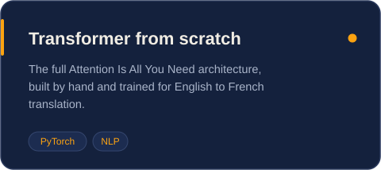
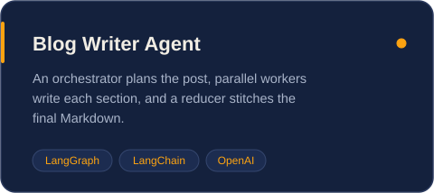
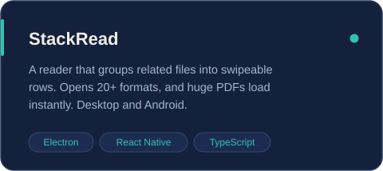
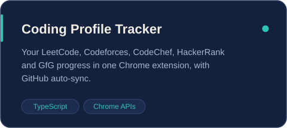
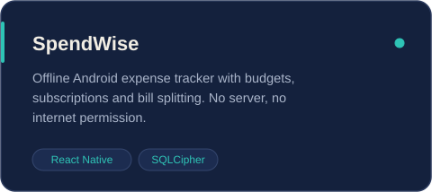
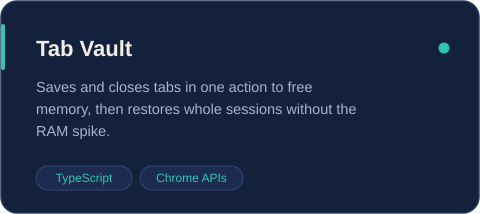
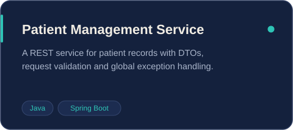

  

  

  
  
  

### About me

- 🎓 B.Tech in Computer Science (IoT) from RKGIT, Ghaziabad, class of 2026, CGPA 8.33
- 🛠️ I work across backend engineering, AI/ML and data, and I like shipping things people can install
- 🔭 Currently building **SpendWise**, an offline, encrypted expense tracker for Android, and the Android port of **StackRead**
- 🌱 Currently sharpening DSA, pattern by pattern, in [LeetCode-What](https://github.com/Saksham-Sharma23/LeetCode-What)
- 💼 Open to backend and AI/ML roles at product companies, GCCs and AI startups

### Tech I use

  

  
  
  
  
  
  

### AI & ML

  
  

  

### Apps & backend

  
  

  
  

  

### GitHub at a glance

  
  

  

  

<picture>
  <source media="(prefers-color-scheme: dark)" srcset="https://raw.githubusercontent.com/Saksham-Sharma23/Saksham-Sharma23/output/github-snake-dark.svg"/>
  
</picture>

 

